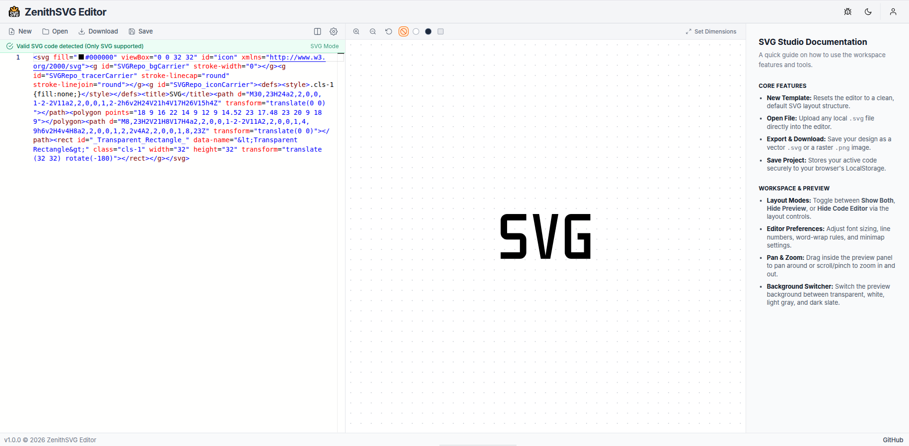

<p align="center">
  <a href="https://zenithsvg-editor.vercel.app/">
    
  </a>
</p>

<h1 align="center">ZenithSVG Editor</h1>

<p align="center">
 A free, open-source online SVG code editor with a live preview. Write SVG code, see instant real-time visual feedback, and export your designs as vector or raster images.
</p>

<p align="center">
  
  <a href="./LICENSE">
    
  </a>
  <a href="https://github.com/byllzz">
    
  </a>
  
  
  
  
  
</p>

<p align="center">
  <a href="https://zenithsvg-editor.vercel.app">
    
  </a>
</p>


# About

**ZenithSVG Editor** is a browser-based SVG design workspace built for designers and developers who work with vector graphics.

It combines a powerful code editor (powered by **Monaco Editor**) with a resizable, pan-and-zoom preview panel, allowing you to craft SVG graphics entirely in your browser.

All logic runs client-side - **no account required, completely free, and no limitations**.

Your projects are automatically saved to your browser's LocalStorage.


# Key Features

- **Live SVG Editing** - Syntax highlighting and full-featured code editing powered by **Monaco Editor** (the engine behind VS Code).
- **Instant Preview** - See SVG changes in real time with pan, zoom, and reset controls.
- **Code Formatting** - One-click SVG/XML formatting via **Prettier**, with automatic formatting applied on save.
- **Flexible Layouts** - Switch between:
  - Show Both
  - Hide Preview
- **Export & Download** - Save designs as:
  - `.svg`
  - `.png`
- **Local Storage Projects** - Automatically save named projects in your browser and manage them from the **Files** page.
- **Live Validity Status** - A status bar flags whether your code contains valid `<svg>` tags before you export.
- **Canvas Background Switcher** - Preview against transparent, white, light gray, or dark slate backgrounds.
- **Custom Canvas Dimensions** - Set exact width/height directly on the root `<svg>` element.
- **Dark & Light Themes** - Synced across the editor, preview, and UI chrome.
- **Workspace Customisation**
  - Font size
  - Tab size
  - Line numbers
  - Minimap
  - Word wrap
  - Auto-closing brackets
  - Whitespace rendering
  - Smooth scrolling
- **Dedicated Pages**
  - Editor (`/`)
  - Files (`/files`) - browse and manage saved projects
  - About (`/about`)

---

# Usage Guide

## 1. Workspace Layout

### Editor Panel

Write and edit SVG code, with real-time validity feedback and one-click Prettier formatting.

### Preview Panel

Visualize your SVG in real time.

- Drag to pan
- Scroll to zoom
- Reset view instantly

---

## 2. Top Toolbar

| Control | Description |
|---------|-------------|
| **New** | Reset to a blank SVG template |
| **Open** | Load a local `.svg` file |
| **Format** | Format the current code with Prettier |
| **Download** | Export as SVG or PNG |
| **Save** | Auto-format and save the project to LocalStorage |
| **Layout Views** | Show Both / Hide Preview |
| **Settings** | Configure editor preferences |

---

## 3. Preview Toolbar

- Zoom In
- Zoom Out
- Reset View

### Background Options

- Transparent
- White
- Light Gray
- Dark Slate

### Canvas Size

Adjust SVG width and height directly from the dimensions dropdown.

---

## 4. Pages

### `/files`

Manage all projects saved to LocalStorage from the Save dropdown.

### `/about`

Learn about the project, the developer, and the open-source libraries it's built on.

---

# Project Structure

```text
src/
├── components/
│   ├── EditorPanel/
│   │   ├── EditorPanel.jsx
│   │   ├── EditorToolbar.jsx
│   │   ├── EditorStatus.jsx
│   │   └── EditorSettings.jsx
│   │
│   ├── PreviewPanel/
│   │   ├── PreviewPanel.jsx
│   │   ├── PreviewToolbar.jsx
│   │   ├── DimensionsDropdown.jsx
│   │   ├── bgOptions.jsx
│   │   ├── dimensionUtils.js
│   │   └── previewUtils.js
│   │
│   ├── Header/
│   │   ├── Header.jsx
│   │   └── UserDropdown.jsx
│   │
│   ├── Layout/
│   │   └── MainLayout.jsx
│   │
│   ├── Footer.jsx
│   └── HelpPanel.jsx
│
├── pages/
│   ├── EditorPage.jsx
│   ├── AboutPage.jsx
│   └── FilesPage.jsx
│
├── context/
│   └── ThemeContext.jsx
│
├── hooks/
│   ├── useLocalStorage.js
│   └── useEditorActions.js
│
├── App.jsx
├── main.jsx
└── index.css
```

---

# Technology Stack

| Technology | Purpose |
|------------|---------|
| **React 18** | UI library |
| **Tailwind CSS** | Styling & responsive design |
| **Monaco Editor** | Code editor (VS Code engine) |
| **Prettier** | SVG/XML code formatting |
| **React Router** | Routing (`/`, `/files`, `/about`) |
| **React Zoom Pan Pinch** | Preview pan & zoom |
| **html-to-image** | Export SVG → PNG |
| **React Icons** | Icon set (Feather / Lucide-style) |
| **Vite** | Build tool & development server |

<p align="left">
  
</p>


# Getting Started

## Prerequisites

- Node.js (v16 or later)
- npm or yarn

## Installation

Clone the repository:

```bash
git clone https://github.com/byllzz/zenithsvg-editor.git
cd zenithsvg-editor
```

Install dependencies:

```bash
npm install

# or

yarn install
```

Start the development server:

```bash
npm run dev
```

Open:

```
http://localhost:5173
```

---

# Contributing

Contributions are welcome!

If you'd like to contribute:

1. Check existing GitHub Issues.
2. Open an issue if your bug or feature isn't already reported.
3. Fork the repository.
4. Create your changes.
5. Submit a pull request.

Please ensure your code follows the project's existing style and linting rules.

# Author

<p align="left">
  
</p>

## Bilal Malik

[](https://github.com/byllzz)
[](https://x.com/bilalmlkdev)
[](https://www.linkedin.com/in/bilalmlkdev/)


If you enjoyed this project, consider giving it a ⭐ on GitHub. It helps others discover the project and motivates future improvements.

<p align="right">
  <a href="#zenithsvg-editor">⬆ Back to Top</a>
</p>

# License (MIT)

This project is licensed under the MIT License.

```text
MIT License

Copyright (c) 2026 Bilal Malik

Permission is hereby granted, free of charge, to any person obtaining a copy
of this software and associated documentation files (the "Software"), to deal
in the Software without restriction, including without limitation the rights
to use, copy, modify, merge, publish, distribute, sublicense, and/or sell
copies of the Software, and to permit persons to whom the Software is
furnished to do so, subject to the following conditions:

The above copyright notice and this permission notice shall be included in all
copies or substantial portions of the Software.

THE SOFTWARE IS PROVIDED "AS IS", WITHOUT WARRANTY OF ANY KIND, EXPRESS OR
IMPLIED, INCLUDING BUT NOT LIMITED TO THE WARRANTIES OF MERCHANTABILITY,
FITNESS FOR A PARTICULAR PURPOSE AND NONINFRINGEMENT. IN NO EVENT SHALL THE
AUTHORS OR COPYRIGHT HOLDERS BE LIABLE FOR ANY CLAIM, DAMAGES OR OTHER
LIABILITY, WHETHER IN AN ACTION OF CONTRACT, TORT OR OTHERWISE, ARISING FROM,
OUT OF OR IN CONNECTION WITH THE SOFTWARE OR THE USE OR OTHER DEALINGS IN THE
SOFTWARE.
```


<p align="left">
  © 2026 Zenithsvg Editor. Licensed under the MIT License.
</p>
