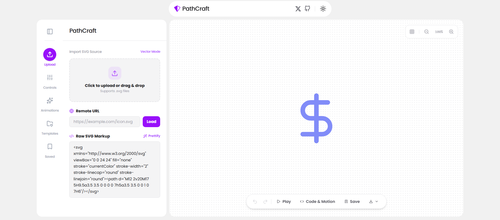
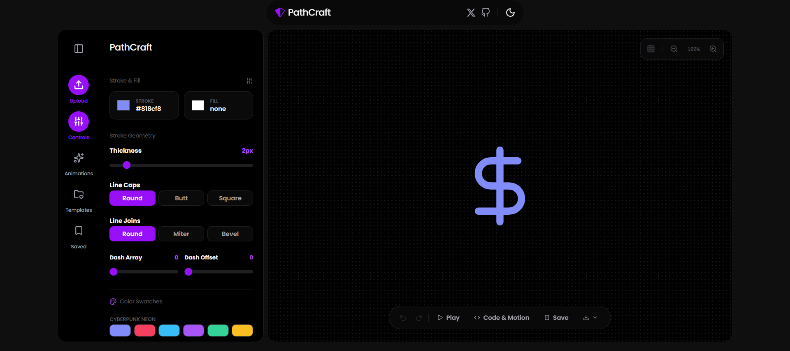

<p align="center">
  
</p>

<h1 align="center">PathCraft</h1>

<p align="center">
  <strong>Design, animate, and export SVG icons - right in your browser.</strong><br />
  A powerful SVG workbench with live preview, built‑in animations, instant code generation, and local storage.
</p>

<p align="center">
  <a href="./LICENSE">
    
  </a>
  
  
  
  
  <a href="https://github.com/byllzz">
    
  </a>
  
  
</p>

<p align="center">
  <a href="https://svgpathcraft.vercel.app">
    
  </a>
</p>

<p align="center">
  
  
</p>

---

## What is PathCraft?

**PathCraft** is a free, open‑source SVG icon design tool that runs entirely in your browser. Import any SVG, tweak its stroke and fill properties, apply stunning animations, and export the result in multiple formats - all without a single line of code.

Whether you're a designer prototyping icons, a developer looking for a ready‑to‑use React component, or a content creator in need of animated assets, PathCraft gives you a clean, fast, and private workspace.

---

## Why PathCraft?

Most SVG editors are either too complex (desktop apps) or too limited (online converters). PathCraft strikes the perfect balance:

- **100% client‑side** - Your SVG never leaves your device.
- **Instant** - No uploads, no waiting, no rate limits.
- **Smart animations** - Choose from 6 ready‑to‑use motion effects.
- **Developer‑friendly** - Generate React JSX, Tailwind classes, or pure CSS keyframes.
- **Offline‑ready** - Works without an internet connection.
- **Open source** - Transparent, free, and community‑driven.

---

## Features

### ✦ Live Preview & Zoom
See your icon update in real time as you adjust properties. Zoom in/out (50‑200%) and toggle between dot, grid, or no grid for precise alignment.

### ✦ Import Any SVG
- **Drag & drop** a `.svg` file onto the canvas.
- **Upload** via the file picker.
- **Paste** raw SVG markup directly.
- **Load** from a remote URL (handles CORS).

### ✦ Stroke & Fill Controls
- Pick **stroke colour** and **fill colour** (with a "clear fill" option).
- Adjust **stroke width** (0.5-16px) with a slider.
- Choose **line caps**: `round`, `butt`, or `square`.
- Choose **line joins**: `round`, `miter`, or `bevel`.
- Fine‑tune **dash array** and **dash offset** for dashed lines.

### ✦ 6 Built‑in Animations
- **Path Draw** - classic stroke tracing effect.
- **Glow Pulse** - rhythmic opacity and glow.
- **360° Spin** - continuous smooth rotation.
- **Breathe Scale** - subtle scaling heartbeat.
- **Vertical Bounce** - playful spring effect.
- **Hover Float** - gentle floating levitation.

Each animation comes with adjustable **duration** (0.2-8s), **delay** (0-5s), and **easing** (smooth, linear, bounce, ease‑in‑out). Toggle play/pause anytime.

### ✦ Code & Export Options
Generate and download your icon in multiple formats:

- **SVG** - raw vector file.
- **Optimized SVG** - minified and cleaned up.
- **React JSX** - ready‑to‑use component.
- **Tailwind CSS** - HTML with Tailwind classes.
- **Keyframes CSS** - standalone CSS animation.
- **Data URI** - base64‑encoded string.

You can **copy** any format to the clipboard or **download** it as a file.

### ✦ Download as PNG & ICO
Export your icon as a **PNG** (512×512) or **ICO** (Windows icon format) directly from the canvas toolbar.

### ✦ Template Library
Choose from a growing collection of preset SVG icons (Currency, Shield, Terminal, Energy, Globe, CPU) to jump‑start your design.

### ✦ Save & Manage Projects
Save your work to **localStorage** with a name and optional description. Re‑load saved projects anytime. Delete projects you no longer need.

### ✦ Undo / Redo
Full history tracking for all changes. Use `Ctrl+Z` / `Ctrl+Y` (or `Cmd+Z` / `Cmd+Y`) to step back and forward.

### ✦ Dark / Light / System Theme
Seamlessly switch between themes - your preference is persisted across sessions.

### ✦ Keyboard Shortcuts
- `Ctrl+Z` / `Cmd+Z` - Undo
- `Ctrl+Y` / `Cmd+Y` - Redo
- `Esc` - Close modals

### ✦ Drag‑and‑Drop Support
Drop an SVG file directly onto the canvas - it will load instantly.

---

## How to Use

| Action | How to do it |
|--------|--------------|
| **Import an SVG** | Drag & drop, upload, paste raw markup, or load from URL. |
| **Change stroke colour** | Click the colour picker in the **Controls** panel. |
| **Change fill colour** | Click the fill colour picker; use **Clear** to remove fill. |
| **Adjust stroke width** | Slide the **Thickness** slider in the **Controls** panel. |
| **Pick a line cap/join** | Click the corresponding button group. |
| **Add a dash** | Use the **Dash Array** and **Dash Offset** sliders. |
| **Apply an animation** | Go to the **Animations** tab and click an animation style. Adjust duration, delay, and easing. |
| **Preview animation** | Click the **Play** button on the canvas toolbar or in the Animations tab. |
| **Export code** | Click the **Code & Motion** button on the canvas toolbar, choose a format, copy or download. |
| **Download as PNG/ICO** | Click the **Download** dropdown on the canvas toolbar and select PNG or ICO. |
| **Save your project** | Click the **Save** button on the canvas toolbar, give it a name, and optionally a description. |
| **Load a saved project** | Go to the **Saved** tab in the side panel and click on any project. |
| **Delete a saved project** | Click the trash icon next to the project in the **Saved** tab. |
| **Use a template** | Go to the **Templates** tab and click any icon to load it. |
| **Toggle grid** | Click the **Grid** button in the top‑right of the canvas. |
| **Zoom in/out** | Use the **+** / **−** buttons in the top‑right of the canvas. |
| **Open the Code Modal** | Click the **Code & Motion** button on the canvas toolbar. |
| **Close any modal** | Press `Esc` or click the backdrop. |
| **Undo/Redo** | Use `Ctrl+Z` / `Ctrl+Y` (or `Cmd+Z` / `Cmd+Y`). |

---

## Tech Stack

| Technology | Purpose |
|------------|---------|
| **React 19** | UI framework |
| **Tailwind CSS v4** | Styling (with dark mode support) |
| **Vite 6** | Build tool |
| **Lucide React** | Icons |
| **React Icons** | Additional icons (GitHub, X) |
| **Vercel** | Deployment (optional) |

All SVG processing is custom‑built - no external libraries used for parsing or optimisation.

---

## Development

### Prerequisites
- Node.js (v18 or later)
- npm or yarn

### Clone & Install
```bash
git clone https://github.com/byllzz/pathcraft.git
cd pathcraft
npm install
```


## Support

If NetPen helps you, consider supporting the project:

- ⭐ Star this repository on GitHub
-  Share it with your friends and community
-  Leave feedback in GitHub Discussions
-  Buy me a coffee


---
  <p align="center">
 © 2026 PathCraft - Open Source MIT
</p>

